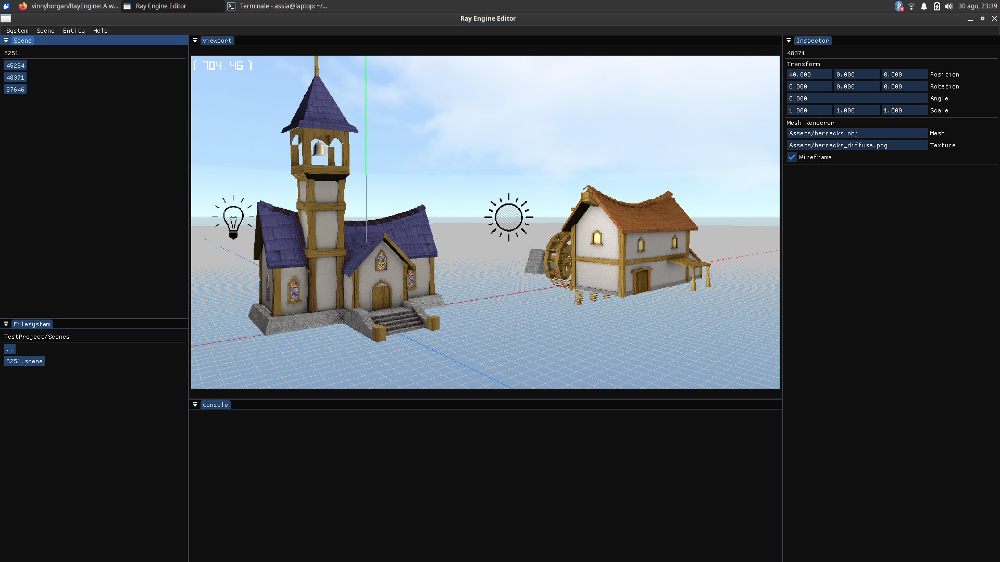

# Ray Engine ⚙️

A 3d engine with editor created for learning purposes.

# Screenshots

# Description

The project is currently composed of an editor and a runtime (just the former for the time being).
The editor serves the purpose of generating scene files that describe objects position, behaviour and more...
These get then fed into the runtime that interprets these files, allowing the creation of any 3d application!

# Libraries

- [Raylib](https://raylib.com)
- [Dear ImGui](https://github.com/ocornut/imgui)
- [Json.NET](https://www.newtonsoft.com/json)

# Disclaimer

DO NOT USE THIS RIGHT NOW. Use the stable [Godot Engine](https://godotengine.org), from which this project takes great inspiration.

# License MIT
